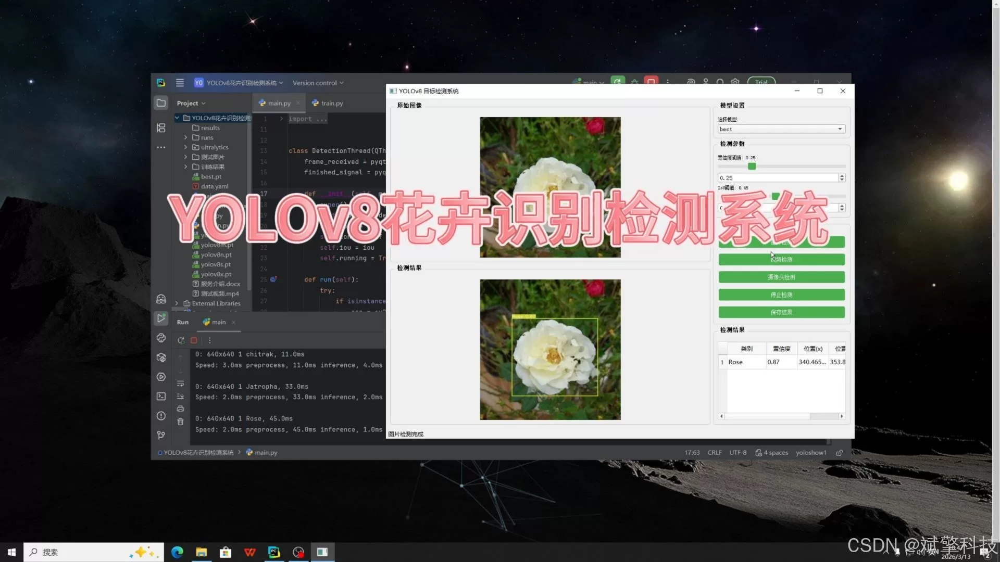
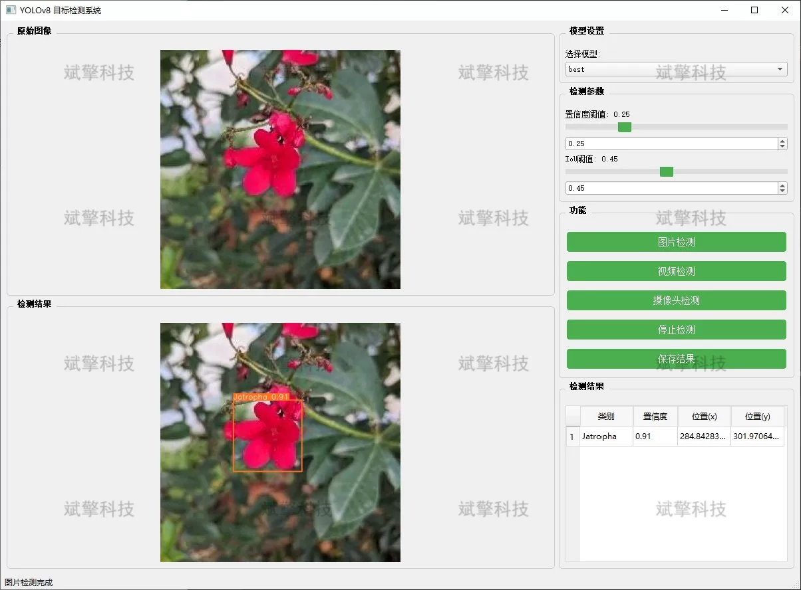
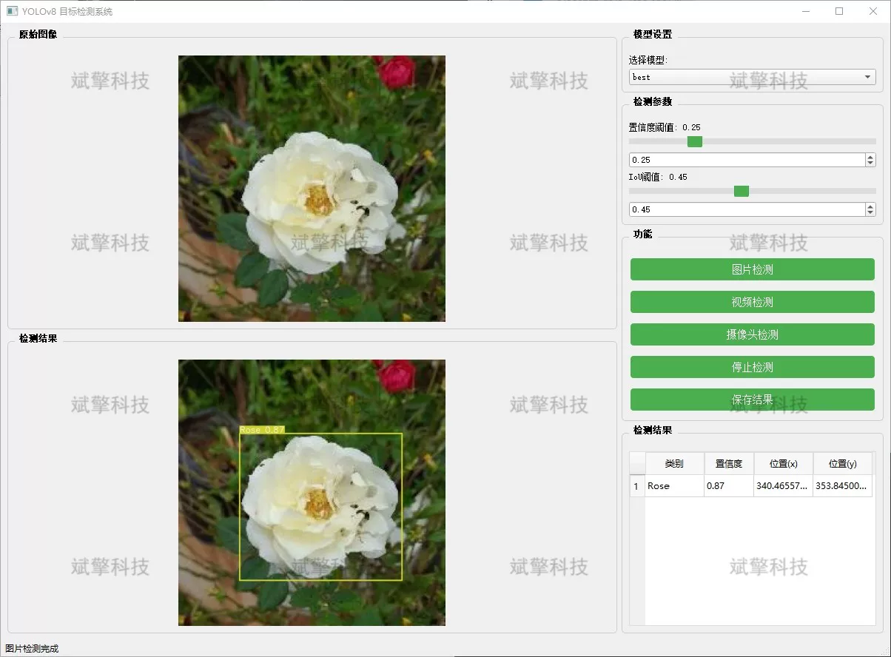
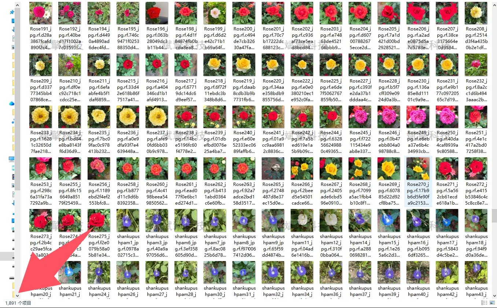
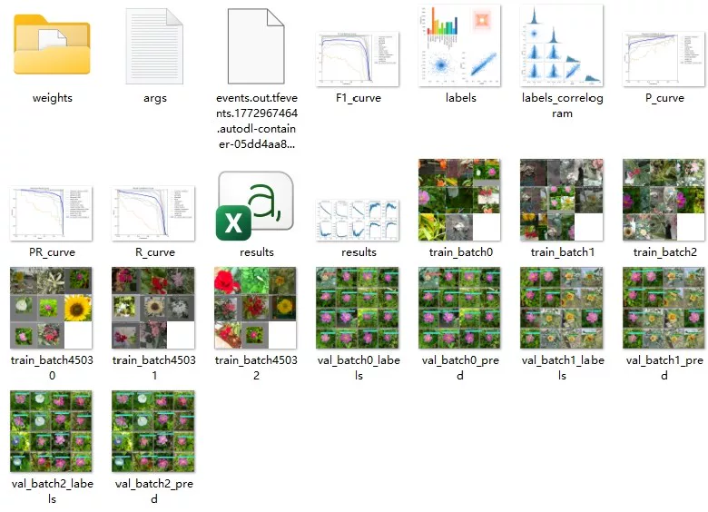
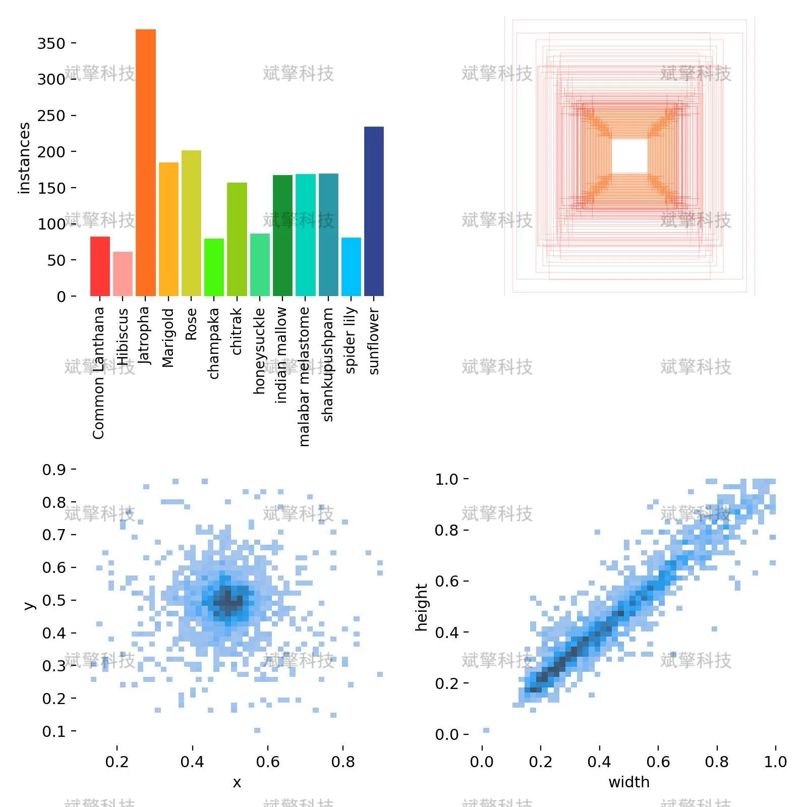
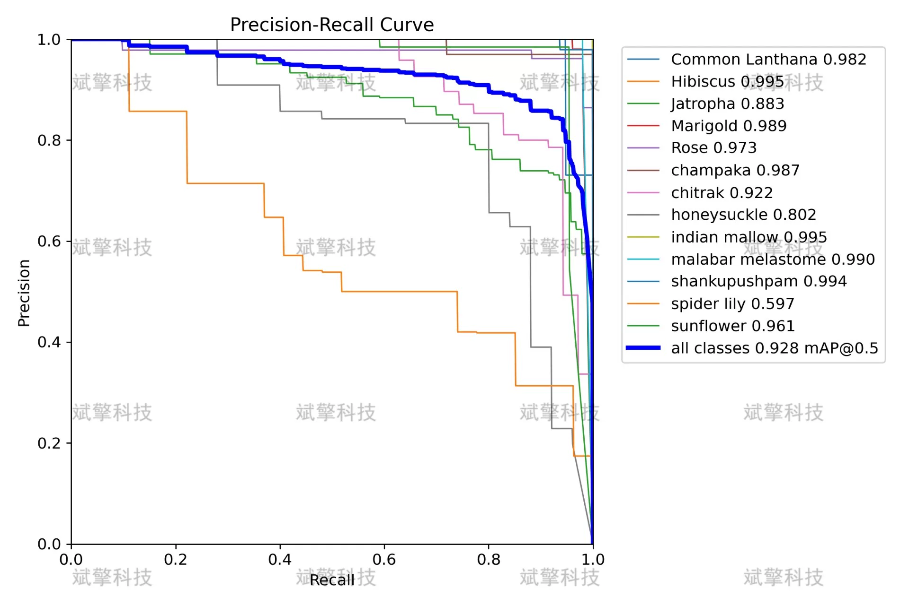
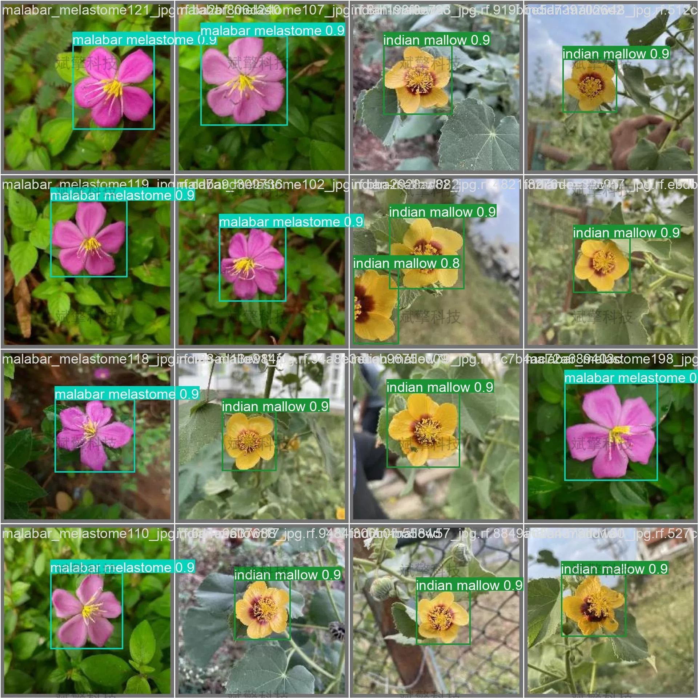

# YOLOv8 Flower Identification Software Resources

## Body

YOLOv8 Flower Recognition Software Resources: A flower recognition detection system based on the YOLOv8 deep learning framework (YOLOv8+YOLO dataset + UI interface + Python project source code + model)

This project has developed a flower recognition detection system based on the YOLOv8 deep learning framework, aiming to solve the problems of low efficiency and low accuracy in traditional flower recognition methods. The system adopts YOLOv8 as the core detection algorithm, which has the advantages of fast detection speed and high accuracy in the field of target detection, especially suitable for real-time detection scenarios.

The system supports three working modes: image detection, video detection, and real-time camera detection, providing users with flexible and diverse usage methods. Through deep learning technology, the system can accurately recognize various flowers such as roses, marigolds, sunflowers, etc., and has important application value in garden plant identification, plant popular science education, and flower resource investigation fields. Experimental results show that this system has good detection accuracy and real-time performance, meeting the needs of actual application scenarios.

System Features

✅ Image Detection: Can detect images and return detection boxes and category information.

✅ Video Detection: Supports input of video files, detecting the situation of each frame in the video.

✅ Real-time Camera Detection: Connects USB cameras to achieve real-time monitoring.

✅ Parameter Real-Time Adjustment (Confidence and IoU Thresholds)

Dataset Overview

Training set: 1891 images, used for model training and learning
Validation set: 529 images, used for model tuning and hyperparameter selection
Test set: 326 images, used for final model performance evaluation

## Images

## Payment

Here is a pay link on Stripe ( https://buy.stripe.com/3cs8yP7sY87d0vu9AB ). Please contact me lonlonago@foxmail.com after funding $89, and I will send you a complete data files , thank you!

